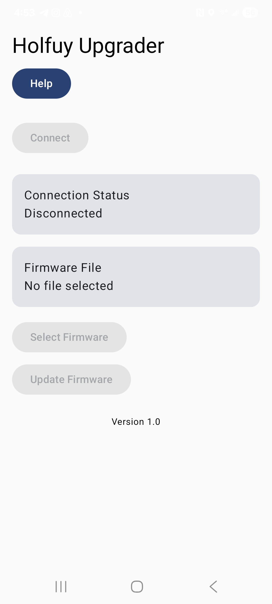
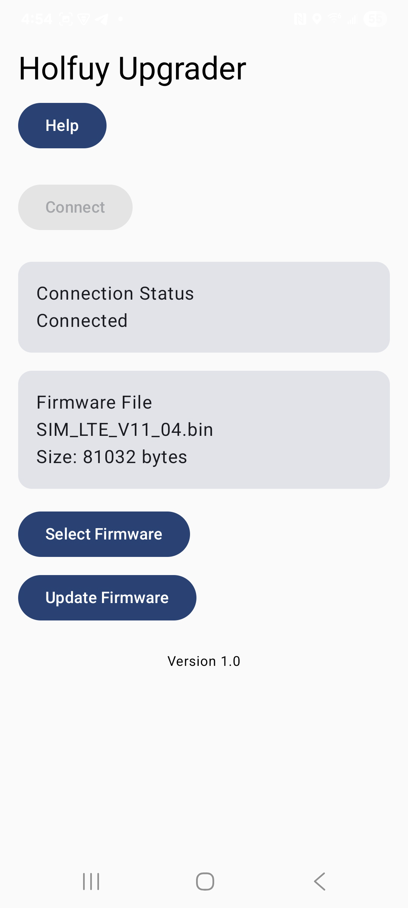
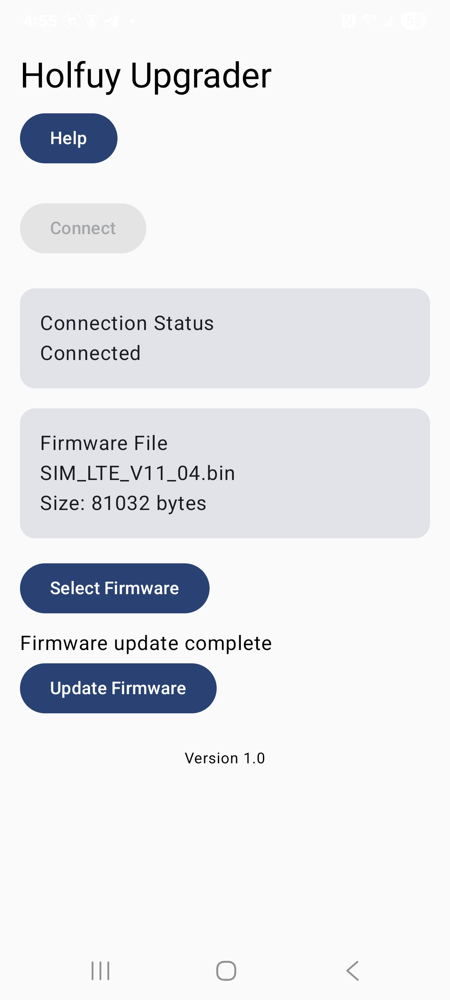

# Holfuy Upgrader

Holfuy Upgrader is an Android application for updating the firmware
of [Holfuy](https://holfuy.com/) weather stations over USB.

The application communicates directly with the station's built-in Nuvoton ISP
(In-System Programming) bootloader and allows firmware updates to be performed
from an Android phone or tablet using a USB OTG connection.

Copyright © 2026 John R. Wolfe

Licensed under the Apache License, Version 2.0. See the LICENSE file for details.

## Screenshots

| | | |
|:-:|:-:|:-:|
|  |  |  |
| **Not Connected** | **Ready to Update** | **Update Complete** |

## Features

* Firmware updates over USB
* Modern Jetpack Compose user interface
* Automatic detection of supported Holfuy weather stations
* Compatible with Android 8.0 (API 26) and later
* Tested on Android 8, 12, 14, and 16

## Requirements

- Android device with USB OTG support
- USB OTG adapter (if required by your device)
- USB cable with a USB Micro-B connector for the weather station
- Firmware image supplied by Holfuy

## Building

This project is built with Android Studio using Kotlin and Jetpack Compose.

Clone the repository and open it with a recent version of Android Studio.

The project uses the Gradle Wrapper, so no separate Gradle installation is required.

## User Guide

Detailed operating instructions are available in the project's
[User Guide](app/src/main/assets/UserGuide.md).

The same guide is also included in the application and can be accessed by tapping **Help** on the main screen.

## Project Status

Current release: **1.0**

This is the initial public release.

## Acknowledgements

This application communicates with the Nuvoton ISP (In-System Programming)
bootloader used by Holfuy weather stations.

The implementation in `protocol/HEXTool.kt`, `protocol/ISPCommands.kt`, and
`protocol/ISPManager.kt` originated from the
[`OpenNuvoton/NuISPTool-Android`](https://github.com/OpenNuvoton/NuISPTool-Android)
project and has been substantially modified and extended during development of
this application.

The upstream project is licensed under the Apache License 2.0.

Special thanks to Holfuy for their assistance during development and testing.

Development of this project was substantially assisted by OpenAI ChatGPT (GPT-5.5).
The author reviewed, tested, and integrated all generated code.

## Contributing

Please include the Android version, device model, and application log when reporting problems.

Pull requests should be discussed in an issue before significant new functionality is added.

## Privacy Policy

Holfuy Upgrader does not collect, store, transmit, or share personal information.

For complete details, see [PrivacyPolicy.md](PrivacyPolicy.md).

## Disclaimer

Firmware updates modify the software stored on the weather station.

Ensure that you are using firmware supplied for your specific Holfuy device.

The authors and contributors are not responsible for damage resulting from
the installation of incorrect firmware or interruption of the firmware update process.